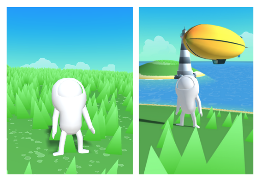

# Fool Guys

Fool Guys, is an experimental sandbox game engine and demo game. The engine works on a server-client architecture with all of the game logic occuring on the server and web based client being soley incharge of handling inputs and rendering. The server is built in Rust and utilises the Rapier Crate for collisions. The client utilises THREE.js to handle the rendering.

Much of the components are insipired by other web based 3D games such as https://github.com/swift502/Sketchbook and https://coastalworld.com/, with some assets being borrowed.

## Project Overview

- **addon** : Blender addon to help with exporting the game state
- **client** : Type Script Game Client
- **server** : Rust game server
- **Blender** : to be organized .blend files and assets

## World Design 

World design is handled in blender. A custom addon parses the blender scene and exports the appropriate asset, world and collision files for both of the server and clients. 

After a change is made in blender and the addon is triggered, this change is reflected in the game. Assets in the game are handled by the built in asset manager within blender which allows the virtual linking of models. These virtual links are inturptted by the addon as markers for in game assets. 

## Features

The engine has support for a variety of features:
- Dynamic Asset Loading
- Projectiles
- Vehicles 
- WIP Navmesh on the navmesh branch

## Developing

Running the client 

```
cd client
npm install
npm run dev
```

Running the server

```
cd server
cargo run
```


## Deploying

Building the client: 
```
cd client
npm run build
```
With docker:
```
docker compose build
docker compose up
```